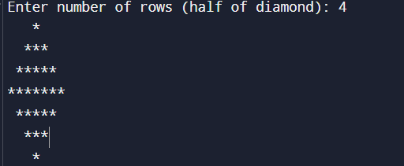

## Spiral matrix

# #ZIg ZAg

## Number pyramid

Enter number of rows: 4
   
 
 

## Hourglass

Enter number of rows: 3

## diamond pattern

Enter number of rows (half of diamond): 4

=== Code Execution Successful ===

## pascal

